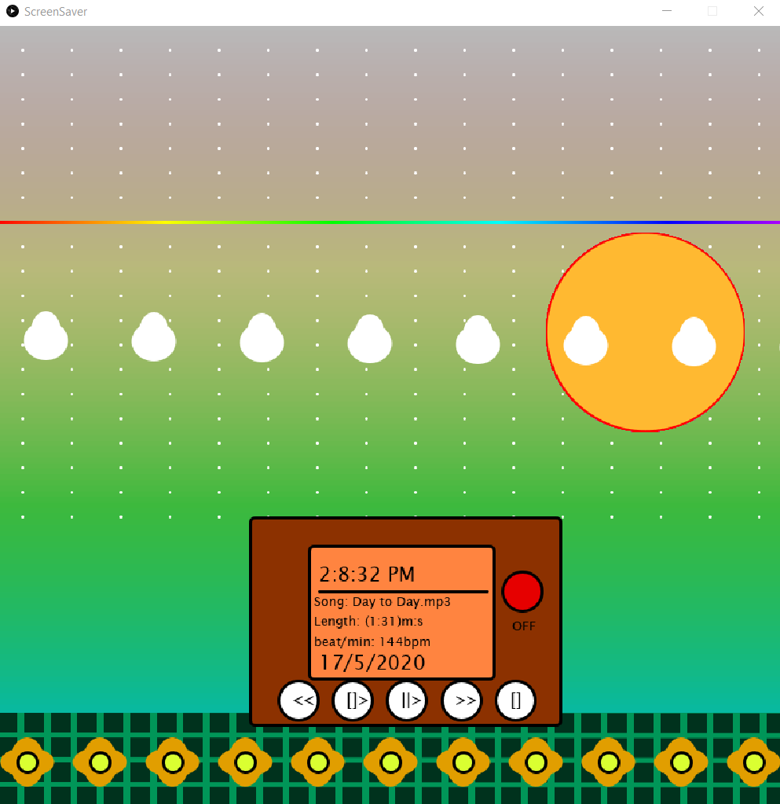

# Music Visualiser Project

Name:Salman AlSamiri

Student Number: D18124618

## Instructions
- Fork this repository and use it a starter project for your assignment
- Create a new package named your student number and put all your code in this package.
- You should start by creating a subclass of ie.tudublin.Visual
- There is an example visualiser called MyVisual in the example package
- Check out the WaveForm and AudioBandsVisual for examples of how to call the Processing functions from other classes that are not subclasses of PApplet

# Description of the assignment
	The idea for this assignment is to create some sort of screen saver that dispalys time play music,while also enjoying the visual displays of objects like the clouds, stars, the sky and the center of it the sun and the moon depending on the time of the day.
	
	The code will display a gradiant sky with stars and audio wave at the top, and at the bottom half the tune box on top of a flower field and the sun/moon will rotate around following the cordinate of the system clock, and tune box will display time and song based on the time, for example it will play the fifth song on the list at 5 in the morning or in the afternoon.
	
	The assignment will also display moving clouds going through the gradient sky, and if a song is played the clouds will continue on their path and back, but it will be lerping on it is path jumping to the beat, along with the stars, all of the flowers changing their petals color and the wave flow will be changing based on the buffer and the frequency of the song that is playing and the more beats per minute the highr the frequency is.
	
	Tune box along with the sun/moon are the center of the assignment the song on the tune box and the sun will be following the clock, as the sun/moon will cordinate be drawn following the cordination of the hour and the song number in the tune box match its list number.  

# Instructions
	The instructions for this code are simple,the code will allow the user to control the tune box via either of the keyboard keys(Space,Up,Down,Left,Right) or mouse clicks on the tune box buttons:
	1. Open the java folder in a compiler
	2. run the code
	3.The following instructions explains how to use the tune box:
		- Play/Pause the song via the * ||> * button on tuneBox or the * Space Bar * on the keyboard. 
		- Clicking the * []> * or pressing the * Up arrow Key * the music will reset and replay from the start. 
		- Pressing the * Left arrow Key * or clicking * << * button will move backward to previous the song in the play list.
		- While the * Right arrow Key * or pressing the * >> * button will change the current song to the following one on the tune box.
		- And the last button * [] * or pressing the * Down arrow key * will stop the tunes and reset the playtime back to the beginning.

# How it works
The program will start by settings() and prepare the screen size to be used, then setup() will intiallise the global variables and pass values to method calls, then after draw() will loop through the given methods to display the program it will check the while loop in there to place a song name position from within the array tuneBox[] that matches the hour on the clock, and although there is 12 songs and the clock uses 24 number, the reminder of mod 12 will be used resulting in playing a song minimum of two times a day.
The sky() method will map lines verticlly going down until it reach half of the screen and will fill the sky in bright gradiant colours, and few more methods uses mapping to place their drawing on the screen cordinate, and will draw stars made of points placed on the screen from the array starLine from class StarySky.

The sunAndMoon() method will draw a circel that is optaing mapped cordinate using quarter of the screen width or height and then map a path based on the current minute and hour for the cricle to rotate through without causing the whole screen to rotate with it too, the rotation line is based of the clock hour,min and second from the processing tutorial, and the sun/moon beam is drawn using the render() method from wave form that will be passed the circle cordinate to be drawn around it and the method will draw points acrross the screen that goes up and down in the y vertex based on the voice sample frequency in the buffer and the bigger its the higher the points will go or down the lower it is.

The flowers() and grass method will draw on the bottom half of the screen using map function and have the flower petals color's get changed based on the buffer and minute on the clock creating vast veraity of color combinations based on minute at the time and the audio buffer. 

The cloud() will be passed a number that will add up and reset from within the method moveflyObj() using push matrix(), translate() and pop matrix() which will draw the clouds moving and lerping from one side of the screen to the other end and back.

The tuneClock() the longest one as it will draw a rect twice one inside of the other and then will place lines of text, a dividing line, a light off/on circle and the buttons followed by their symblos from the controlButtons array the 3rd array to have its data loaded from an outside clss, The first line will be the time displaying hour:min:sec and using an array that will check wether it is Day/aftermidnight AM or Night/afternoon PM, and then the data from the class SongsPlayList and use time and a global variable to be set on the song matching the hour,followed by day/month year and last line is the control buttons that will use keyPressed and mousePressed to control the music.

# What I am most proud of in the assignment
The sunAndMoon method, the tuneClock, sky and clouds 

1. sunAndMoon started as the focus of the assignment trying to create a 3d sphere but that did not go as wanted so swapped it for a circle 

2. the tuneClock became a main part of the assignment as I was working through, but it was fun to make.

3. the sky method was supposed to be a simple method and it is, but having it display in its current form turned out to be more than I excpected to be.

4. the clouds was done early on during the beinginning stage and the way it fainly flowing through is great improvment that it started as. 


This is the code:

```Java
package MusicVisualAssignment.D18124618_Salman_Alsamiri;

import java.util.ArrayList;
import ddf.minim.analysis.FFT;
import processing.data.Table;

import processing.data.TableRow;

public class ScreenSaver extends MyVisuals
{
    ArrayList <TuneControls>controlButtons = new ArrayList<TuneControls>();

    ArrayList <Starsky> StarLine = new ArrayList<Starsky>();

    ArrayList <SongPlayList> tuneBox = new ArrayList<SongPlayList>();
    
    //Global objects & Variables 
    WaveForms wf;
    SongPlayList spl;
    FFT fft;
    float w ;
    float wHalf;
    float h;
    float hoursRadiusY;
    float hoursRadiusX;
    String musicFile; 
    int tuneOrder;
    int tunerKey;
    
    public void settings()
    {
        size(800,800);
    }   

    public void setup()
    {   
        w = width*0.8f;
        wHalf = width*0.5f;
        h = height*0.5f;
        int elipseRadius = min(width, height) /2;
        hoursRadiusY = (elipseRadius*0.50f);
        hoursRadiusX = (elipseRadius *0.50f);
        tuneOrder = hour()%12;
        musicFile="Morning Routine.mp3";
        tunerKey=0;
        colorMode(HSB);
        setSampleRate(44100);
        setFrameSize(1024);
        fft = new FFT(1, getSampleRate());
        startMinim();
        loadAudio(musicFile);
        wf = new WaveForms(this);
        calculateFrequencyBands();
        loadData();
        smooth();
    }

    public void loadData()
    {
        Table table = loadTable("controlButtons.csv","header");
        for(TableRow row:table.rows())
        {
            TuneControls c = new TuneControls(row);
            controlButtons.add(c);
        }


        Table tableday = loadTable("StarPostions.csv","header");
        for(TableRow row:tableday.rows())
        {
            Starsky s = new Starsky(row);
            StarLine.add(s);
        }

        Table tableSong = loadTable("SongsOfTheDay.csv","header");
        for(TableRow row:tableSong.rows())
        {
            SongPlayList spl = new SongPlayList(row);
            tuneBox.add(spl);
        }
        
    }

    public void grass()
    {   
        int hG=10+(int)h;
        noStroke();
        fill(110,255,150);
        rect(0, 700, width, h-30);
        for(int i=0; i<width; i++)
        {
            fill(110,255,50);
            float xg =  map(i, 0, 30, 0, width+10);
            float yg =  map(i, 0, h, h+350, hG+350);
            square(xg, yg-50, 20);
            square(xg, yg-25, 20);
            square(xg, yg, 20);
            square(xg, yg+25, 20);
        }
        
    }

    public void flowers()
    {
        
        int hflower = height-50;
        for(int i=0; i<width; i++)
        {
            float xt =  map(i, 0, 5, 30, wHalf);
            noStroke();
            fill(getAudioBuffer().get(i)*minute()*10+30,255,225);
            ellipse(xt, hflower, 35, 50);
            noStroke();
            ellipse(xt, hflower, 55, 30);
            stroke(110,255,0);
            fill(50,205,255);
            ellipse(xt, hflower, 20, 20);
        }
        
    }
    
    public void keyPressed()
    {
        
        if (key == ' ')
        {
            if((getAudioPlayer().isPlaying())==true)
            {
                getAudioPlayer().pause();
            }
            else
            {
                getAudioPlayer().play();
            }
            
        }
        if(keyCode == DOWN)
        {
            getAudioPlayer().pause();
            getAudioPlayer().cue(0);
        }
        if(keyCode == UP)
        {
            getAudioPlayer().pause();
            getAudioPlayer().cue(0);
            getAudioPlayer().play();
        }
        if(keyCode == RIGHT && tuneOrder==tuneBox.size()-1)
        {
            getAudioPlayer().pause();
            getAudioPlayer().cue(0);
            tuneOrder=0;
            loadAudio(tuneBox.get(tuneOrder).getSongName());
            getAudioPlayer().play();
           
        }
        else if(keyCode== RIGHT)
        {
            getAudioPlayer().pause();
            getAudioPlayer().cue(0);
            tuneOrder++;
            loadAudio(tuneBox.get(tuneOrder).getSongName()); 
            getAudioPlayer().play();
            
        }
        if(keyCode == LEFT&& tuneOrder==0)
        {
            getAudioPlayer().pause();
            getAudioPlayer().cue(0);
            tuneOrder=tuneBox.size()-1;
            loadAudio(tuneBox.get(tuneOrder).getSongName());
            getAudioPlayer().play();
        }
        else if(keyCode == LEFT)
        {
            getAudioPlayer().pause();
            getAudioPlayer().cue(0);
            tuneOrder--;
            loadAudio(tuneBox.get(tuneOrder).getSongName());
            getAudioPlayer().play();
            
        }

    }

    public void mousePressed()
    {
        
        if((mouseX>=ctrlMousX[0]-15&&mouseX<=ctrlMousX[0]+15)&&(mouseY>=ctrlMousY[0]-15&&mouseY<=ctrlMousY[0]+15))
        { 
            getAudioPlayer().pause();
            getAudioPlayer().cue(0);
            if(tuneOrder==0)
            {
                tuneOrder=tuneBox.size()-1;
                loadAudio(tuneBox.get(tuneOrder).getSongName());
            }
            else
            {
                tuneOrder--;
                loadAudio(tuneBox.get(tuneOrder).getSongName());
            }
            getAudioPlayer().play();
        }
        if((mouseX>=ctrlMousX[1]-15&&mouseX<=ctrlMousX[1]+15)&&(mouseY>=ctrlMousY[1]-15&&mouseY<=ctrlMousY[1]+15))
        {
            getAudioPlayer().pause();
            getAudioPlayer().cue(0);
            getAudioPlayer().play();
        }
        if((mouseX>=ctrlMousX[2]-15&&mouseX<=ctrlMousX[2]+15)&&(mouseY>=ctrlMousY[2]-15&&mouseY<=ctrlMousY[2]+15))
        {
            if((getAudioPlayer().isPlaying())==true)
            {
                getAudioPlayer().pause();
            }
            else
            {
                getAudioPlayer().play();
            }
        }
        if((mouseX>=ctrlMousX[3]-15&&mouseX<=ctrlMousX[3]+15)&&(mouseY>=ctrlMousY[3]-15&&mouseY<=ctrlMousY[3]+15))
        {
            getAudioPlayer().pause();
            getAudioPlayer().cue(0);
            if(tuneOrder==tuneBox.size()-1)
            {
                tuneOrder=0;
                loadAudio(tuneBox.get(tuneOrder).getSongName());
            }
            else
            {
                tuneOrder++;
                loadAudio(tuneBox.get(tuneOrder).getSongName());
            }
            getAudioPlayer().play();
        }
        if((mouseX>=ctrlMousX[4]-15&&mouseX<=ctrlMousX[4]+15)&&(mouseY>=ctrlMousY[4]-15&&mouseY<=ctrlMousY[4]+15))
        {
            if((getAudioPlayer().isPlaying())==true)
            {
                getAudioPlayer().pause();
                getAudioPlayer().cue(0);
            }
        }
        

    }

    public void sky()
    {
        float skyY;

        
        
        for(int gridCounter = 0 ; gridCounter < h;gridCounter++)
        {
           skyY = map(gridCounter , 0, 70, 0, h);
            noStroke();
            fill((150*(getSmoothedBands()[gridCounter%10])+gridCounter*2)-gridCounter, (255*getSmoothedAmplitude()+gridCounter*2), (185));
            rect(0, skyY , width , 100);
            
        }
        for(Starsky s:StarLine)
        {
            stroke(255,0,255);
            point((s.getStarX()*getSmoothedAmplitude()+s.getStarX()),s.getStarY()*getSmoothedAmplitude()+s.getStarY());
            point((s.getStarX2()*getSmoothedAmplitude()+s.getStarX2()),s.getStarY2()*getSmoothedAmplitude()+s.getStarY2());

        }
          
    }
    
    float elipseRX;
    float elipseRY;
    float ellipseRSize;
    public void SunAndMoon()
    {    
        float ellipseSize = 200 + (getSmoothedAmplitude() * 300);
        float hPos = map(hour() + norm(minute(), 0, 60), 0, 24, 0, TWO_PI * 2) - HALF_PI;
        float ellipseX = (wHalf+cos(hPos)*hoursRadiusX)+80;
        float ellipseY = (h+sin(hPos)*hoursRadiusY);
        noStroke();
        if(hour()>4&&hour()<19)
        {
            fill(28,205,255);
        }
        else
        {
            fill(160,45,155);
        }
        
        ellipse(ellipseX, ellipseY, ellipseSize,ellipseSize);  
        elipseRX=ellipseX;
        elipseRY=ellipseY; 
        ellipseRSize=ellipseSize;
    
    }

    float skyObj=10;
    
    public void clouds(float movX)
    {
        float cloudO=(height/2.5f);
        float cloudE=((height/2.5f)-10);
        
        for(int No=0;No < width;No++)
        {
                int cloudH= (int)((cloudE+cloudO)*getSmoothedAmplitude())/2;
                float cloudX=lerp(1, (cloudH), getAudioBuffer().get(No));
                pushMatrix();
                float xc = map(No, 0,7, 0, width-30);
                noStroke();
                float i = movX+xc;
                fill(255, 0, 255); 
                translate(5, (cloudX+No)+(cloudX+No)*getAudioBuffer().get(No));               
                ellipse(i, cloudO, 45, 40);
                ellipse(i, cloudE, 30, 40);
                popMatrix();
        }

    }


     public void moveflyObj()
     {
         skyObj++;

         if(skyObj>width-15)
         {
            skyObj=15;
         }

     }

     
    int[] ctrlMousY = new int[5];
     int []ctrlMousX=new int[5];
     public void tuneClock()
     {
         float wClk = w-(w*0.6f);
         float hClk = h+(h*0.25f);
         float clockX=map(200, 0, 200, 0, wClk);

         float clockY=map(200, 0, 200, 0, hClk);

         int clockCenter=1;

         int clockColor=2;

         int clockCounter=0;

         int midnightCheck=0;
         int hourText=(hour()%12)+midnightCheck;

         String APM[]={" AM"," PM"};

        for(int frameNo=1; frameNo<=2;frameNo++)
        {
            fill(15,255/frameNo+clockColor,70*clockColor);
            stroke(255,255,0);
            rect(clockX+clockCenter, clockY+(clockCenter/frameNo), (315+clockCenter)/frameNo, (210+clockCenter)/frameNo,5);
            clockCenter+=60;
            clockColor+=clockCenter;
            
        } 
        
        fill(255, 255, 0);
        textSize(20);
        strokeWeight(3);
        if(hour()>11||hour()==0)
        {
            clockCounter=1;
        }
        else
        {
            clockCounter=0;
        }

       while(hour()==0)
       {
         midnightCheck=12;
       }
        text(hourText+":"+minute()+":"+second()+APM[clockCounter], clockX+(clockCenter-50), (clockY+clockCenter-55));
        line(clockX+(clockCenter-50), (clockY+clockCenter-45), clockX+(clockCenter*2), (clockY+clockCenter-45));
        text(day()+"/"+month()+"/"+year(), clockX+(clockCenter-50), (clockY+clockCenter+35));
        textSize(13);
        text(tuneBox.get(tuneOrder).toString(), clockX+(clockCenter-55), (clockY+clockCenter-30));
        //clock mp3 player on/off 
        float buttonPlaceX =(clockX+(clockCenter))+clockCenter*1.3f;
        if(getAudioPlayer().isPlaying()==true)
        {
            text("ON !",buttonPlaceX-10, (clockY+clockCenter-5));
            fill(100, 255, 230);
            ellipse(buttonPlaceX, (clockY+clockCenter-45), 40, 40);
        }
        else
        {
         
            text("OFF",buttonPlaceX-10, (clockY+clockCenter-5));
            fill(0, 255, 230);
            ellipse(buttonPlaceX, (clockY+clockCenter-45), 40, 40);
        }
        float controlButtonsY = clockY+clockCenter*1.55f;
        for(int clcki=0;clcki<5;clcki++)
        {
            TuneControls tc = controlButtons.get(clcki);
            float controlButtonsX=map(clcki, 0, 5, clockX+50, (clockCenter-50)+clockX*2);
            stroke(255,255,0);
            fill(200,0,255);
            ellipse(controlButtonsX, controlButtonsY, 40, 40);
            fill(200,255,0);
            textSize(18);
            text(tc.getbuttonValue(), controlButtonsX-6, controlButtonsY+5);
            ctrlMousX[clcki]=(int)controlButtonsX;
            ctrlMousY[clcki]=(int)controlButtonsY;
            // println("X:"+ctrlMousX[clcki]+" Y:"+ctrlMousY[clcki]);

        }
        
     }
    
  
   
    public void draw()
    {    
        background(165,155,255);
        sky();
        calculateAverageAmplitude();
        calculateFrequencyBands();
        wf.render(elipseRX,elipseRY,ellipseRSize);
        SunAndMoon();
        clouds(skyObj); 
        moveflyObj();
        grass();
        flowers();
        tuneClock();
        
        while(tunerKey==0)
        { 
            tunerKey=1;
            getAudioPlayer().cue(0);
            musicFile=tuneBox.get(tuneOrder).getSongName();
            loadAudio(musicFile); 
        }
    }
}
```

So is this without specifying the language:

```
package MusicVisualAssignment.D18124618_Salman_Alsamiri;

import java.util.ArrayList;
import ddf.minim.analysis.FFT;
import processing.data.Table;

import processing.data.TableRow;

public class ScreenSaver extends MyVisuals
{
    ArrayList <TuneControls>controlButtons = new ArrayList<TuneControls>();

    ArrayList <Starsky> StarLine = new ArrayList<Starsky>();

    ArrayList <SongPlayList> tuneBox = new ArrayList<SongPlayList>();
    
    //Global objects & Variables 
    WaveForms wf;
    SongPlayList spl;
    FFT fft;
    float w ;
    float wHalf;
    float h;
    float hoursRadiusY;
    float hoursRadiusX;
    String musicFile; 
    int tuneOrder;
    int tunerKey;
    
    public void settings()
    {
        size(800,800);
    }   

    public void setup()
    {   
        w = width*0.8f;
        wHalf = width*0.5f;
        h = height*0.5f;
        int elipseRadius = min(width, height) /2;
        hoursRadiusY = (elipseRadius*0.50f);
        hoursRadiusX = (elipseRadius *0.50f);
        tuneOrder = hour()%12;
        musicFile="Morning Routine.mp3";
        tunerKey=0;
        colorMode(HSB);
        setSampleRate(44100);
        setFrameSize(1024);
        fft = new FFT(1, getSampleRate());
        startMinim();
        loadAudio(musicFile);
        wf = new WaveForms(this);
        calculateFrequencyBands();
        loadData();
        smooth();
    }

    public void loadData()
    {
        Table table = loadTable("controlButtons.csv","header");
        for(TableRow row:table.rows())
        {
            TuneControls c = new TuneControls(row);
            controlButtons.add(c);
        }


        Table tableday = loadTable("StarPostions.csv","header");
        for(TableRow row:tableday.rows())
        {
            Starsky s = new Starsky(row);
            StarLine.add(s);
        }

        Table tableSong = loadTable("SongsOfTheDay.csv","header");
        for(TableRow row:tableSong.rows())
        {
            SongPlayList spl = new SongPlayList(row);
            tuneBox.add(spl);
        }
        
    }

    public void grass()
    {   
        int hG=10+(int)h;
        noStroke();
        fill(110,255,150);
        rect(0, 700, width, h-30);
        for(int i=0; i<width; i++)
        {
            fill(110,255,50);
            float xg =  map(i, 0, 30, 0, width+10);
            float yg =  map(i, 0, h, h+350, hG+350);
            square(xg, yg-50, 20);
            square(xg, yg-25, 20);
            square(xg, yg, 20);
            square(xg, yg+25, 20);
        }
        
    }

    public void flowers()
    {
        
        int hflower = height-50;
        for(int i=0; i<width; i++)
        {
            float xt =  map(i, 0, 5, 30, wHalf);
            noStroke();
            fill(getAudioBuffer().get(i)*minute()*10+30,255,225);
            ellipse(xt, hflower, 35, 50);
            noStroke();
            ellipse(xt, hflower, 55, 30);
            stroke(110,255,0);
            fill(50,205,255);
            ellipse(xt, hflower, 20, 20);
        }
        
    }
    
    public void keyPressed()
    {
        
        if (key == ' ')
        {
            if((getAudioPlayer().isPlaying())==true)
            {
                getAudioPlayer().pause();
            }
            else
            {
                getAudioPlayer().play();
            }
            
        }
        if(keyCode == DOWN)
        {
            getAudioPlayer().pause();
            getAudioPlayer().cue(0);
        }
        if(keyCode == UP)
        {
            getAudioPlayer().pause();
            getAudioPlayer().cue(0);
            getAudioPlayer().play();
        }
        if(keyCode == RIGHT && tuneOrder==tuneBox.size()-1)
        {
            getAudioPlayer().pause();
            getAudioPlayer().cue(0);
            tuneOrder=0;
            loadAudio(tuneBox.get(tuneOrder).getSongName());
            getAudioPlayer().play();
           
        }
        else if(keyCode== RIGHT)
        {
            getAudioPlayer().pause();
            getAudioPlayer().cue(0);
            tuneOrder++;
            loadAudio(tuneBox.get(tuneOrder).getSongName()); 
            getAudioPlayer().play();
            
        }
        if(keyCode == LEFT&& tuneOrder==0)
        {
            getAudioPlayer().pause();
            getAudioPlayer().cue(0);
            tuneOrder=tuneBox.size()-1;
            loadAudio(tuneBox.get(tuneOrder).getSongName());
            getAudioPlayer().play();
        }
        else if(keyCode == LEFT)
        {
            getAudioPlayer().pause();
            getAudioPlayer().cue(0);
            tuneOrder--;
            loadAudio(tuneBox.get(tuneOrder).getSongName());
            getAudioPlayer().play();
            
        }

    }

    public void mousePressed()
    {
        
        if((mouseX>=ctrlMousX[0]-15&&mouseX<=ctrlMousX[0]+15)&&(mouseY>=ctrlMousY[0]-15&&mouseY<=ctrlMousY[0]+15))
        { 
            getAudioPlayer().pause();
            getAudioPlayer().cue(0);
            if(tuneOrder==0)
            {
                tuneOrder=tuneBox.size()-1;
                loadAudio(tuneBox.get(tuneOrder).getSongName());
            }
            else
            {
                tuneOrder--;
                loadAudio(tuneBox.get(tuneOrder).getSongName());
            }
            getAudioPlayer().play();
        }
        if((mouseX>=ctrlMousX[1]-15&&mouseX<=ctrlMousX[1]+15)&&(mouseY>=ctrlMousY[1]-15&&mouseY<=ctrlMousY[1]+15))
        {
            getAudioPlayer().pause();
            getAudioPlayer().cue(0);
            getAudioPlayer().play();
        }
        if((mouseX>=ctrlMousX[2]-15&&mouseX<=ctrlMousX[2]+15)&&(mouseY>=ctrlMousY[2]-15&&mouseY<=ctrlMousY[2]+15))
        {
            if((getAudioPlayer().isPlaying())==true)
            {
                getAudioPlayer().pause();
            }
            else
            {
                getAudioPlayer().play();
            }
        }
        if((mouseX>=ctrlMousX[3]-15&&mouseX<=ctrlMousX[3]+15)&&(mouseY>=ctrlMousY[3]-15&&mouseY<=ctrlMousY[3]+15))
        {
            getAudioPlayer().pause();
            getAudioPlayer().cue(0);
            if(tuneOrder==tuneBox.size()-1)
            {
                tuneOrder=0;
                loadAudio(tuneBox.get(tuneOrder).getSongName());
            }
            else
            {
                tuneOrder++;
                loadAudio(tuneBox.get(tuneOrder).getSongName());
            }
            getAudioPlayer().play();
        }
        if((mouseX>=ctrlMousX[4]-15&&mouseX<=ctrlMousX[4]+15)&&(mouseY>=ctrlMousY[4]-15&&mouseY<=ctrlMousY[4]+15))
        {
            if((getAudioPlayer().isPlaying())==true)
            {
                getAudioPlayer().pause();
                getAudioPlayer().cue(0);
            }
        }
        

    }

    public void sky()
    {
        float skyY;

        
        
        for(int gridCounter = 0 ; gridCounter < h;gridCounter++)
        {
           skyY = map(gridCounter , 0, 70, 0, h);
            noStroke();
            fill((150*(getSmoothedBands()[gridCounter%10])+gridCounter*2)-gridCounter, (255*getSmoothedAmplitude()+gridCounter*2), (185));
            rect(0, skyY , width , 100);
            
        }
        for(Starsky s:StarLine)
        {
            stroke(255,0,255);
            point((s.getStarX()*getSmoothedAmplitude()+s.getStarX()),s.getStarY()*getSmoothedAmplitude()+s.getStarY());
            point((s.getStarX2()*getSmoothedAmplitude()+s.getStarX2()),s.getStarY2()*getSmoothedAmplitude()+s.getStarY2());

        }
          
    }
    
    float elipseRX;
    float elipseRY;
    float ellipseRSize;
    public void SunAndMoon()
    {    
        float ellipseSize = 200 + (getSmoothedAmplitude() * 300);
        float hPos = map(hour() + norm(minute(), 0, 60), 0, 24, 0, TWO_PI * 2) - HALF_PI;
        float ellipseX = (wHalf+cos(hPos)*hoursRadiusX)+80;
        float ellipseY = (h+sin(hPos)*hoursRadiusY);
        noStroke();
        if(hour()>4&&hour()<19)
        {
            fill(28,205,255);
        }
        else
        {
            fill(160,45,155);
        }
        
        ellipse(ellipseX, ellipseY, ellipseSize,ellipseSize);  
        elipseRX=ellipseX;
        elipseRY=ellipseY; 
        ellipseRSize=ellipseSize;
    
    }

    float skyObj=10;
    
    public void clouds(float movX)
    {
        float cloudO=(height/2.5f);
        float cloudE=((height/2.5f)-10);
        
        for(int No=0;No < width;No++)
        {
                int cloudH= (int)((cloudE+cloudO)*getSmoothedAmplitude())/2;
                float cloudX=lerp(1, (cloudH), getAudioBuffer().get(No));
                pushMatrix();
                float xc = map(No, 0,7, 0, width-30);
                noStroke();
                float i = movX+xc;
                fill(255, 0, 255); 
                translate(5, (cloudX+No)+(cloudX+No)*getAudioBuffer().get(No));               
                ellipse(i, cloudO, 45, 40);
                ellipse(i, cloudE, 30, 40);
                popMatrix();
        }

    }


     public void moveflyObj()
     {
         skyObj++;

         if(skyObj>width-15)
         {
            skyObj=15;
         }

     }

     
    int[] ctrlMousY = new int[5];
     int []ctrlMousX=new int[5];
     public void tuneClock()
     {
         float wClk = w-(w*0.6f);
         float hClk = h+(h*0.25f);
         float clockX=map(200, 0, 200, 0, wClk);

         float clockY=map(200, 0, 200, 0, hClk);

         int clockCenter=1;

         int clockColor=2;

         int clockCounter=0;

         int midnightCheck=0;
         int hourText=(hour()%12)+midnightCheck;

         String APM[]={" AM"," PM"};

        for(int frameNo=1; frameNo<=2;frameNo++)
        {
            fill(15,255/frameNo+clockColor,70*clockColor);
            stroke(255,255,0);
            rect(clockX+clockCenter, clockY+(clockCenter/frameNo), (315+clockCenter)/frameNo, (210+clockCenter)/frameNo,5);
            clockCenter+=60;
            clockColor+=clockCenter;
            
        } 
        
        fill(255, 255, 0);
        textSize(20);
        strokeWeight(3);
        if(hour()>11||hour()==0)
        {
            clockCounter=1;
        }
        else
        {
            clockCounter=0;
        }

       while(hour()==0)
       {
         midnightCheck=12;
       }
        text(hourText+":"+minute()+":"+second()+APM[clockCounter], clockX+(clockCenter-50), (clockY+clockCenter-55));
        line(clockX+(clockCenter-50), (clockY+clockCenter-45), clockX+(clockCenter*2), (clockY+clockCenter-45));
        text(day()+"/"+month()+"/"+year(), clockX+(clockCenter-50), (clockY+clockCenter+35));
        textSize(13);
        text(tuneBox.get(tuneOrder).toString(), clockX+(clockCenter-55), (clockY+clockCenter-30));
        //clock mp3 player on/off 
        float buttonPlaceX =(clockX+(clockCenter))+clockCenter*1.3f;
        if(getAudioPlayer().isPlaying()==true)
        {
            text("ON !",buttonPlaceX-10, (clockY+clockCenter-5));
            fill(100, 255, 230);
            ellipse(buttonPlaceX, (clockY+clockCenter-45), 40, 40);
        }
        else
        {
         
            text("OFF",buttonPlaceX-10, (clockY+clockCenter-5));
            fill(0, 255, 230);
            ellipse(buttonPlaceX, (clockY+clockCenter-45), 40, 40);
        }
        float controlButtonsY = clockY+clockCenter*1.55f;
        for(int clcki=0;clcki<5;clcki++)
        {
            TuneControls tc = controlButtons.get(clcki);
            float controlButtonsX=map(clcki, 0, 5, clockX+50, (clockCenter-50)+clockX*2);
            stroke(255,255,0);
            fill(200,0,255);
            ellipse(controlButtonsX, controlButtonsY, 40, 40);
            fill(200,255,0);
            textSize(18);
            text(tc.getbuttonValue(), controlButtonsX-6, controlButtonsY+5);
            ctrlMousX[clcki]=(int)controlButtonsX;
            ctrlMousY[clcki]=(int)controlButtonsY;
            // println("X:"+ctrlMousX[clcki]+" Y:"+ctrlMousY[clcki]);

        }
        
     }
    
  
   
    public void draw()
    {    
        background(165,155,255);
        sky();
        calculateAverageAmplitude();
        calculateFrequencyBands();
        wf.render(elipseRX,elipseRY,ellipseRSize);
        SunAndMoon();
        clouds(skyObj); 
        moveflyObj();
        grass();
        flowers();
        tuneClock();
        
        while(tunerKey==0)
        { 
            tunerKey=1;
            getAudioPlayer().cue(0);
            musicFile=tuneBox.get(tuneOrder).getSongName();
            loadAudio(musicFile); 
        }
    }
}
```

These are images of the output using a relative URL:




These are images of the output using an absolute URL:


This is a youtube video:
[](https://youtu.be/FpJllRVE9as)
[](https://youtu.be/kEIHs-tjRFQ)


